# All Mermaid Diagram Types

Test file covering all 22+ Mermaid diagram types for manual and automated verification.

## 1. Flowchart

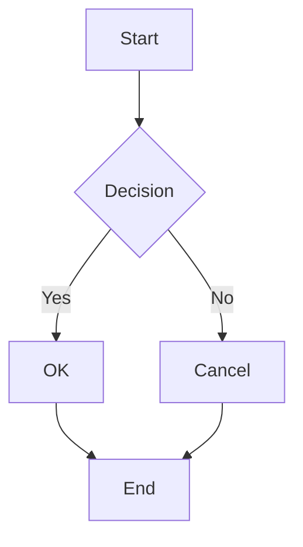

## 2. Graph (flowchart alias)

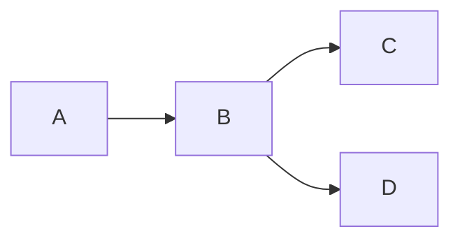

## 3. Sequence Diagram

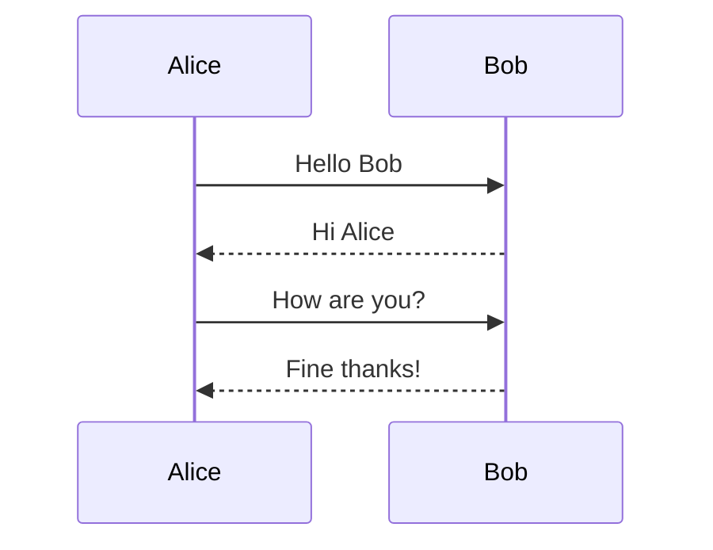

## 4. Class Diagram

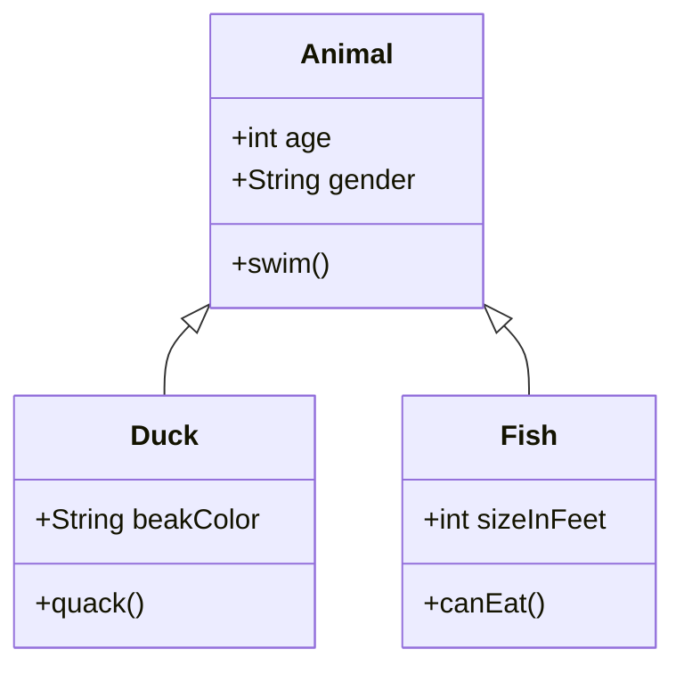

## 5. State Diagram v2

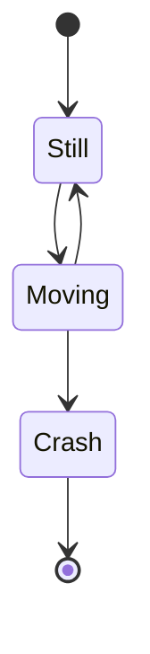

## 6. Entity Relationship Diagram

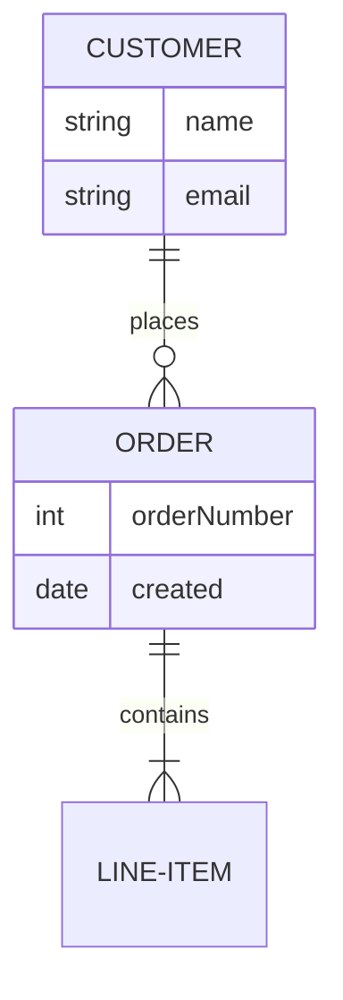

## 7. User Journey

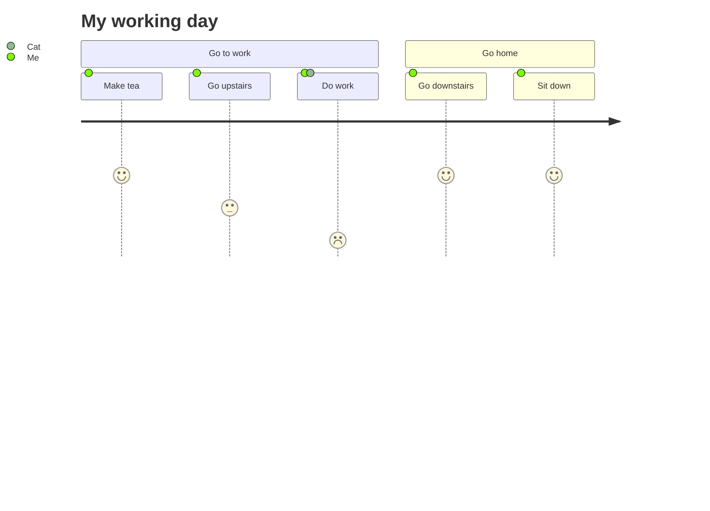

## 8. Gantt Chart

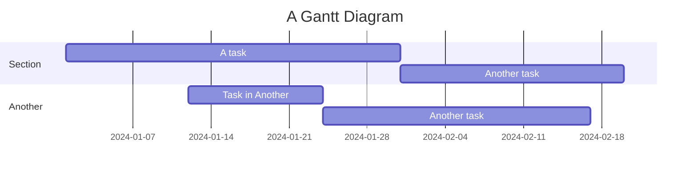

## 9. Pie Chart

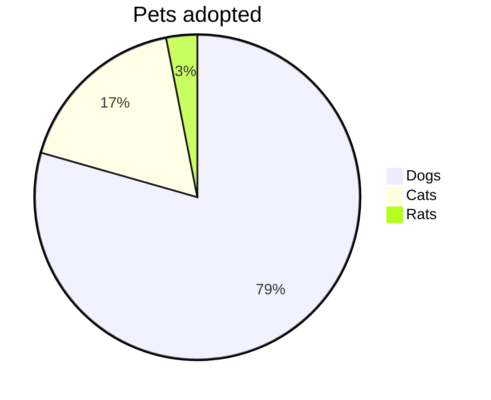

## 10. Git Graph

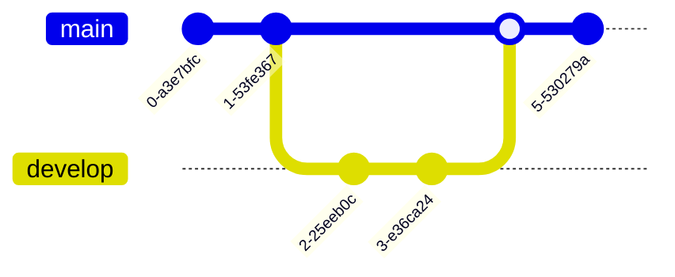

## 11. Mindmap

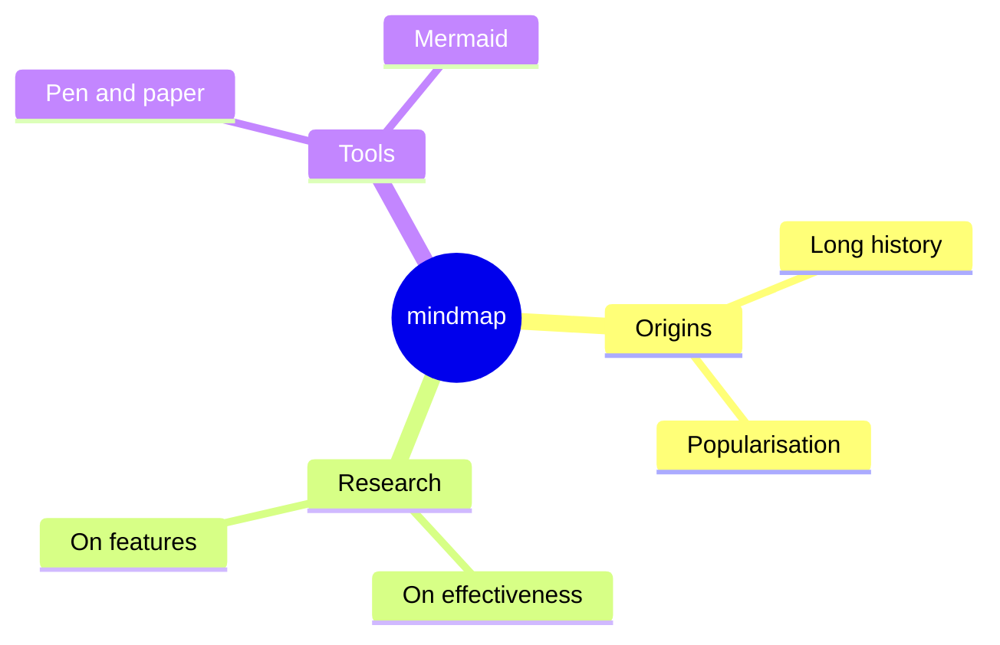

## 12. Timeline

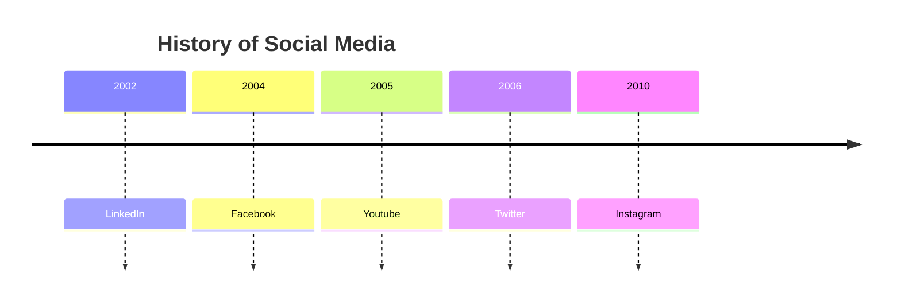

## 13. Quadrant Chart

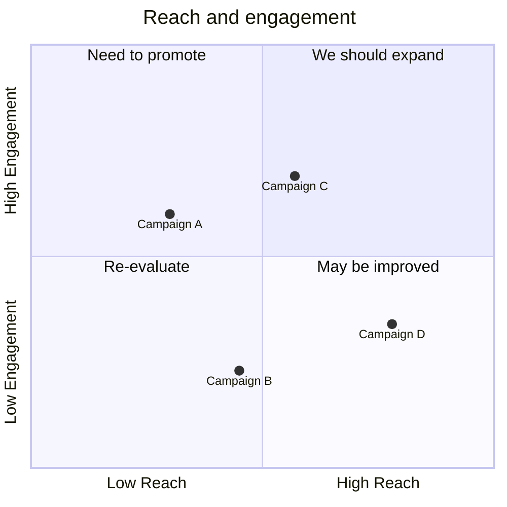

## 14. XY Chart (beta)

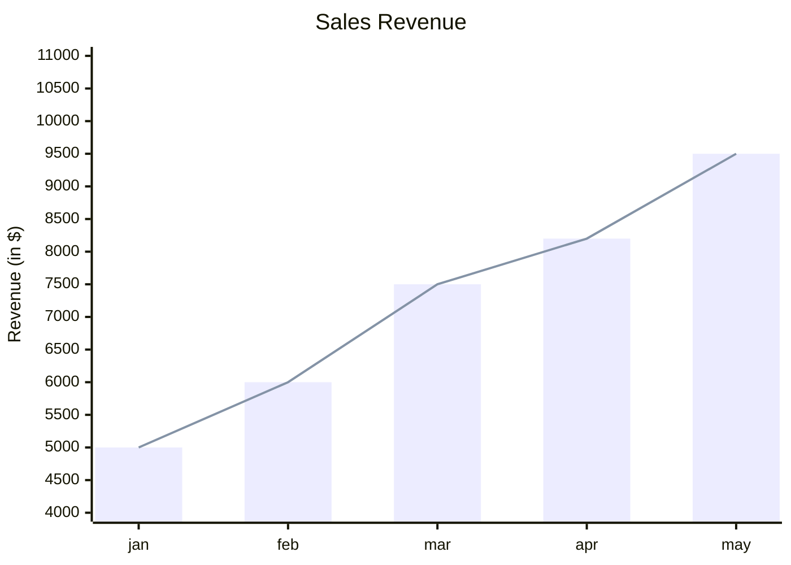

## 15. Sankey (beta)

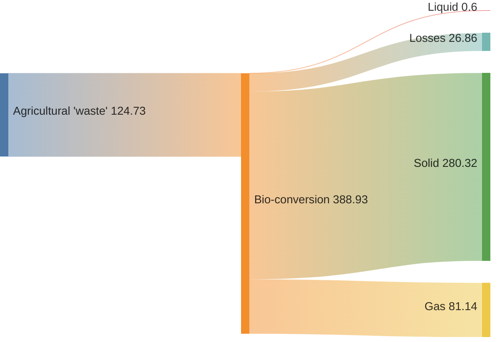

## 16. Requirement Diagram

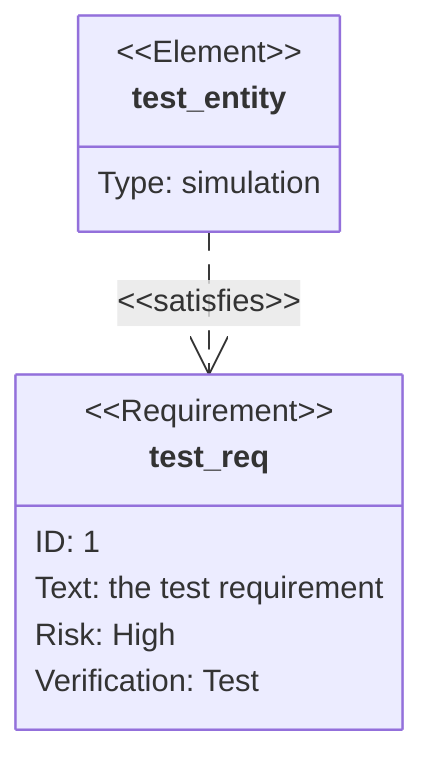

## 17. C4 Context

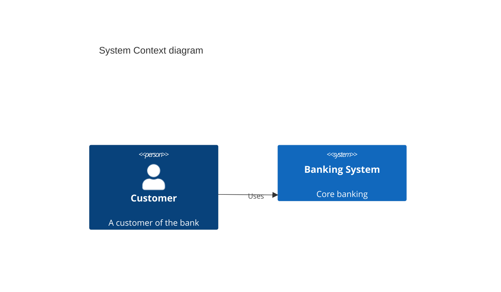

## 18. ZenUML

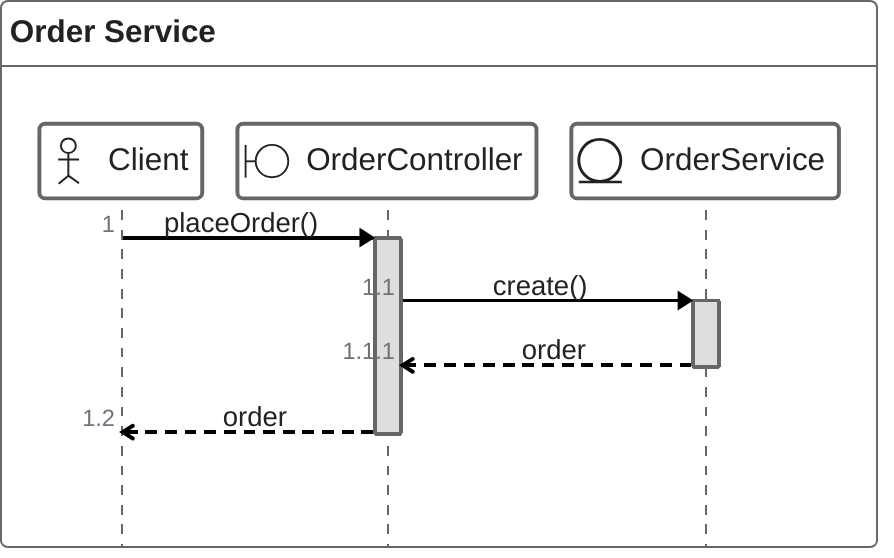

## 19. Block (beta)

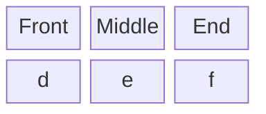

## 20. Packet (beta)

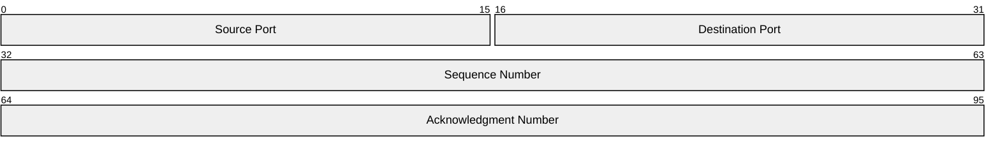

## 21. Architecture (beta)

```mermaid
architecture-beta
    group api(cloud)[API]

    service db(database)[Database] in api
    service server(server)[Server] in api

    db:R -- L:server
```

## 22. Kanban

```mermaid
kanban
    column1["To Do"]
        task1["Task 1"]
        task2["Task 2"]
    column2["In Progress"]
        task3["Task 3"]
    column3["Done"]
        task4["Task 4"]
```

---

## Edge Cases

### Empty block (should be skipped gracefully)

```mermaid
```

### Special characters

```mermaid
flowchart TD
    A["Node with 'quotes'"] --> B["Node with <brackets>"]
    B --> C["Node with & ampersand"]
```

### Large diagram (many nodes)

```mermaid
flowchart TD
    N1 --> N2 --> N3 --> N4 --> N5
    N5 --> N6 --> N7 --> N8 --> N9 --> N10
    N10 --> N11 --> N12 --> N13 --> N14 --> N15
    N15 --> N16 --> N17 --> N18 --> N19 --> N20
    N1 --> N10
    N5 --> N15
    N10 --> N20
```
